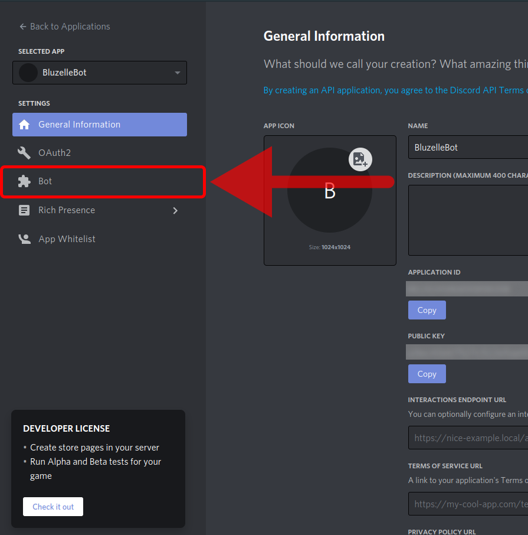
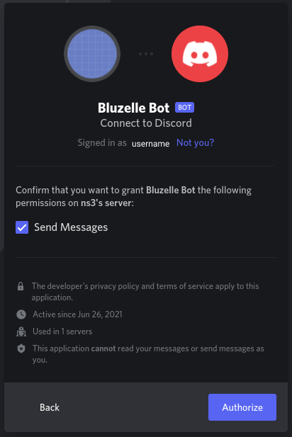

# DiscordBluzelleBot
<details open="open">
  <summary><h2 style="display: inline-block">Table of Contents</h2></summary>
  <ol>
    <li>
      <a href="#about-the-project">About The Project</a>
      <ul>
        <li><a href="#built-with">Built With</a></li>
      </ul>
    </li>
    <li>
      <a href="#getting-started">Getting Started</a>
      <ul>
        <li><a href="#prerequisites">Prerequisites</a></li>
        <li><a href="#installation">Installation</a></li>
      </ul>
    </li>
    <li><a href="#usage">Usage</a></li>
    <li><a href="#test">Test</a></li>
    <li><a href="#contact">Contact</a></li>
    <li><a href="#license">License</a></li>
  </ol>
</details>


<!-- ABOUT THE PROJECT -->
## About The Project

This Bluzelle Discord Bot has 7 commands which retrieves information from bluzelle mainnet, bluzelle testnet and coingecko servers.
</br>
</br>
[challenge](https://gitcoin.co/issue/bluzelle/Gitcoin10Hack/7/100025962)

### Built With

* [node.js](https://nodejs.org/)

<!-- GETTING STARTED -->
## Getting Started

### Prerequisites

* Node.js installed on your development machine. To install this on macOS or Ubuntu 18.04, follow the steps from [this link](https://www.digitalocean.com/community/tutorials/how-to-install-node-js-and-create-a-local-development-environment-on-macos).
* Any text editor of your choice.
* A free Discord account with a verified email account and a free Discord server you will use to test your Discord bot.

### Installation

#### step 1. Setting Up a Discord Bot and get the bot’s token
   * In order to register a bot on the Discord platform, use the [Discord application dashboard](https://discord.com/developers/applications/). Here developers can create Discord applications including Discord bots.
  
   
   * Click New Application. Discord will ask you to enter a name for your new application. Then click Create to create the application.
    
   
   * Now open up your application dashboard. To add a bot to the application, navigate to the Bot tab on the navigation bar to the left.
   
   
   * Click the Add Bot button to add a bot to the application
   
   
   * Click the Yes, do it! button when it prompts you for confirmation. You will then be on a dashboard containing details of your bot’s name, authentication token, and profile picture.
   
   
   * navigate to the OAuth2 tab of the application dashboard. To create an invite, scroll down and select bot under scopes.
   
   
   * You must also set permissions to control what actions your bot can perform in guilds. For the purposes of this simplicity, select Administrator. Copy the link with the Copy button (under scopes).
   
   
   * Next, add the bot to a server. Follow the invite link you just created. You can add the bot to any server you own, or have administrator permissions in, from the drop-down menu. Now click Continue.
    
   
   * Ensure you have the tickbox next to Administrator ticked, this will grant the bot administrator permissions. Then click Authorize.
    
   
   * You’ll now have the Discord bot on the members list in the server you added the bot to under offline.
   
   
#### Step 3. Clone the repo and rename
   ```sh
   git clone https://github.com/mushroomgenie/DiscordBluzelleBot.git
   ```
   or download it directly
   
   * Rename '.env.example' file to '.env'.
   * You also need to copy the bot’s authentication token by clicking Click to Reveal Token and copying the token that appears. and paste it in the .env file
   
   
  
#### Step 4. Install all the required dependencies.
  ```
  npm install
  ```
#### Step 5. Finally execute the node application.
  ```
  node index.js
  ```


<!-- USAGE EXAMPLES -->
## Usage

We use ```.``` as prefix for all commands.
</br>Use ```.help``` command for more information.

Accepted commands in the Bluzelle Bot

 * Current price:  ```.price [currency]```
    </br>Example: .price inr, .price eur
    
 * About Market Cap:  ```.market [currency]```
    </br>Example: .market inr, .market eur
    
 * About Active Validators:  ```.validators [testnet | mainnet]```
    </br>Example: .validators t, .validators main
    
 * About Blocks:  ```.blocks [testnet | mainnet]```
    </br>Example: .blocks t, .blocks main
    
 * Balance of Account(use Direct message):  ```.balance [address]```
    </br>Example: .balance your_bluzelle_address

 * Mint testnet Account:  ```.mint```
    </br>Example: .mint

Accepted currencies for price and market commands</br>
aed, ars, aud, bch, bdt, bhd, bmd, bnb, brl, btc, cad, chf, clp, cny, czk, dkk, dot, eos, eth, eur, gbp, hkd, huf, idr, ils, inr, jpy, krw, kwd, lkr, ltc, mmk, mxn, myr, ngn, nok, nzd, php, pkr, pln, rub, sar, sek, sgd, thb, try, twd, uah, usd, vef, vnd, xag, xau, xdr, xlm, xrp, yfi, zar, bits, link, sats

</br>screenshots


<!-- Test -->
## Test
Go to [Test with Jest](/jest)


<!-- Contact -->
## Contact

Satya Snehith</br>
Email - nsssnehit76@gmail.com 
</br>
GitHub - https://github.com/SatyaSnehith 
</br>
</br>
Mashrukh
</br> 
Email -  mashthegreat@gmail.com
</br>
GitHub - https://github.com/mushroomgenie

<!-- LICENSE -->
## License

Distributed under the MIT License.
