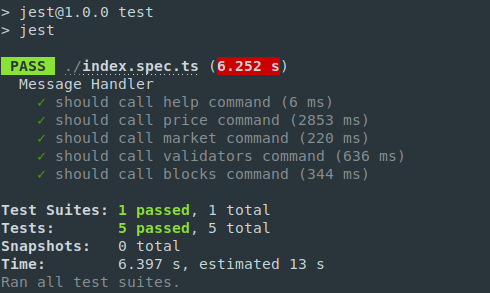

# Test with Jest
Jest is a JavaScript Testing Framework with a focus on simplicity.
## Usage
#### Step 1. Open terminal in the jest folder and install all the required dependencies.
  ```
  npm install
  ```
#### Step 2. Run tests.
  ```
  npm test
  ```
## ScreenShot


